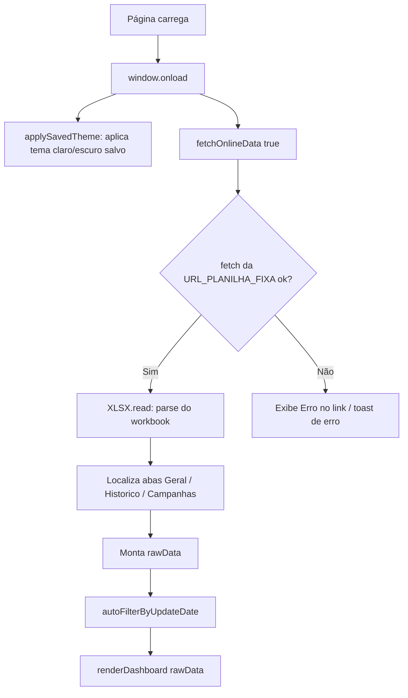

# 🏗️ Arquitetura Técnica

## Visão Geral

O `index.html` é uma **Single Page Application (SPA) estática**, sem framework, sem build step e sem backend. Toda a lógica está contida em três blocos:

```
index.html
├── <head>
│   ├── CDN: TailwindCSS
│   ├── CDN: Font Awesome 6
│   ├── CDN: SheetJS (xlsx.full.min.js)
│   └── <style> ... CSS customizado (cards, gráficos, modo escuro) ... </style>
├── <body>
│   └── Markup estático (header, KPIs, gráficos, tabelas — vazios, preenchidos via JS)
└── <script>
    ├── Constantes globais (META_ALUNOS, CAPACIDADE_MAX, URL_PLANILHA_FIXA, ...)
    ├── Funções utilitárias (formatação, datas, cálculo de metas)
    ├── Carregamento de dados (fetchOnlineData, generateMockData, upload manual)
    └── Renderização (renderDashboard, renderEmptyTableState, gráficos)
```

---

## Fluxo de Execução



### Renderização (`renderDashboard`)

A função `renderDashboard(data)` é o **coração do dashboard** e é chamada sempre que:
- Os dados são carregados pela primeira vez (`fetchOnlineData`)
- Um arquivo Excel é importado manualmente (`#uploadExcel`)
- O usuário clica em uma barra do gráfico de sazonalidade (`selectMonth`)
- Dados de teste são gerados (`generateMockData`)

Ela é responsável por **todo o ciclo de atualização da UI**, dividido nos seguintes blocos internos:

| Bloco | Responsabilidade |
|---|---|
| 1. Última atualização | Lê `Config["Última atualização"]` e exibe no header |
| 2. Banner de filtro | Mostra/oculta o banner conforme `selectedMonth` |
| 3. Gráfico de sazonalidade | Monta as barras `v25`/`v26` por mês (escala fixa de 15M) |
| 4. Tabelas de campanhas | Filtra `Campanhas` por mês, classifica por `Status` (Agendado/Enviado/Pausado/Cancelado) e soma os valores `Base` |
| 5. KPIs de meta | Calcula Realizado, Projetado, % da meta, Saldo e cores condicionais |
| 6. Status diário da meta | Compara ritmo ideal (dia do mês / dias do mês) vs. ritmo real (`calcularStatusMetaTemporal`) |
| 7. Gráfico "Foco" | Monta o comparativo lateral (Ano anterior, Ano atual, Projetado, Geral) |

---

## Estado Global (Variáveis)

| Variável | Tipo | Descrição |
|---|---|---|
| `rawData` | `object \| null` | Dados completos carregados da planilha (abas `Config`, `Historico`, `Campanhas`, `Geral`) |
| `selectedMonth` | `string \| null` | Mês atualmente filtrado (`'Jan'`, `'Fev'`, ... ou `null` = visão anual) |
| `META_ALUNOS` | `number` (const) | Meta mensal do CRM Alunos (11.700.000) |
| `CAPACIDADE_MAX` | `number` (const) | Capacidade compartilhada mensal (20.000.000) |
| `meses` | `string[]` (const) | `['Jan','Fev','Mar','Abr','Mai','Jun','Jul','Ago','Set','Out','Nov','Dez']` |
| `STORAGE_KEY` | `string` (const) | Chave usada no `localStorage` para salvar o link da planilha |

> ⚠️ Não há um "estado" reativo (como Vue/React). Toda alteração de dado exige uma chamada explícita a `renderDashboard(rawData)`.

---

## Persistência Local (`localStorage`)

| Chave | Conteúdo | Usada por |
|---|---|---|
| `theme` | `'dark'` ou `'light'` | `applySavedTheme()` / `toggleTheme()` |
| `crm_dashboard_sheet_url` | URL da planilha (modo de link manual, atualmente não exposto na UI) | `fetchOnlineData()` / `clearSavedLink()` |

---

## Modos de Carregamento de Dados

O dashboard suporta **três fontes de dados**, mas apenas uma está ativa por padrão:

1. **🔵 Ativo — Link fixo (`URL_PLANILHA_FIXA`)**
   Definido diretamente no código, aplicado automaticamente no `window.onload`.

2. **🟡 Disponível, mas oculto — Importação manual de Excel**
   Input `#uploadExcel` (label `#btnImport`), com atributo `hidden`. Ao ativar, lê o arquivo local via `FileReader` + `XLSX.read(..., {type: 'binary'})`.

3. **🟡 Disponível, mas comentado — Mock de dados (`generateMockData`)**
   Gera dados aleatórios para teste/desenvolvimento, útil quando não há link configurado.

> 🟢 **Recomendação**: caso seja necessário alternar a fonte de dados em produção (ex: trocar de link fixo para upload manual), reativar os elementos removendo o atributo `hidden` dos botões `#btnImport` / `#btnUpdate` e ajustar o `window.onload`.

---

## Modo Claro / Escuro

Implementado via classe `.dark` na raiz (`<html>`), alternada por `toggleTheme()` e persistida em `localStorage.theme`. Os estilos do modo escuro estão centralizados em um bloco de overrides CSS (seletores `.dark ...`) que cobrem:

- Fundo geral e cards (`body`, `.report-card`, `header`, `#filterBanner`)
- Textos (títulos, labels, KPIs específicos por ID)
- Inputs, tabelas, badges, toasts e botões (`#btnImport`, `#themeToggle`, `#btnUpdate`)

---

## Dependências Externas (CDN)

| Biblioteca | Uso | Observação |
|---|---|---|
| **TailwindCSS** (`cdn.tailwindcss.com`) | Estilização utilitária | Carregada via `<script>`, sem build/purge — adequado para projeto estático simples |
| **Font Awesome 6** | Ícones (sol/lua, upload, refresh, toast, etc.) | CDN `cdnjs.cloudflare.com` |
| **SheetJS / XLSX 0.18.5** | Leitura de arquivos `.xlsx` (online e upload manual) | CDN `cdnjs.cloudflare.com` |
| **Google Fonts (Inter)** | Tipografia | Importado via `@import` no CSS |

> 🟡 **Hipótese de risco**: por depender de CDNs externos, o dashboard **não funciona offline** e está sujeito à disponibilidade desses serviços.
